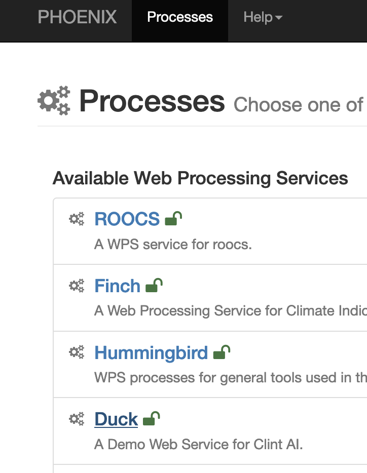
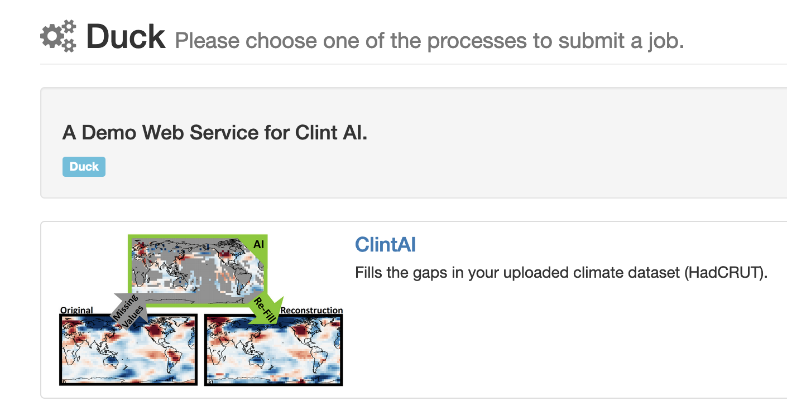
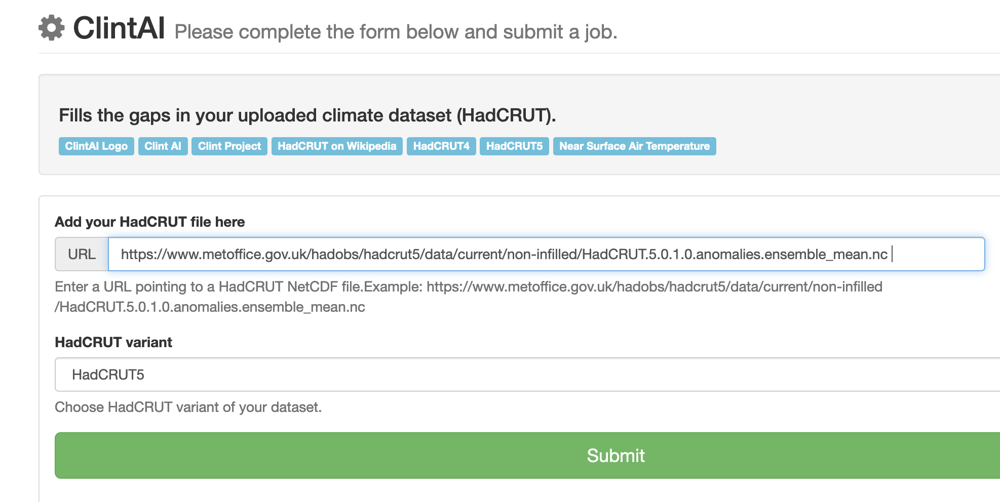
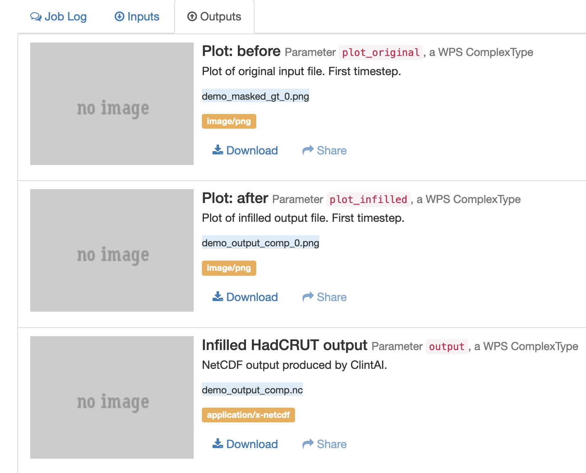
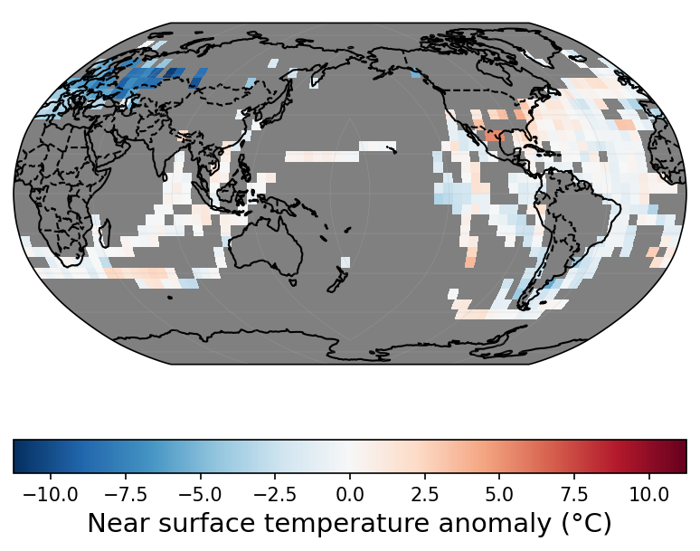
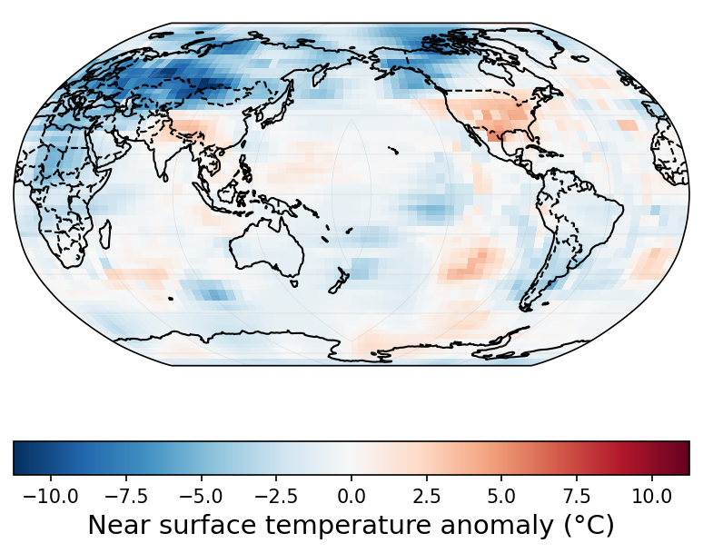

# GUI for Climate Services Information Systems

## Example: Phoenix

* Birdhouse provides a web-based application where scientific data assessment can be executed over a Grapical User Interphase (GUI), the provided package is [Phoenix](https://github.com/bird-house/pyramid-phoenix). Phoenix is a web application to work with processing services, which can be made accessible via an online portal. Here is an example demonstrator developed within the [CLINT Project](https://climateintelligence.eu/) providing services for weather extreme event detection. The services are deployed on virtual machines at the German Climate Computeing Center [DKRZ](https://www.dkrz.de/en/). In the following example we run the  infill missing values process over a portal based on the [Phoenix App](https://github.com/bird-house/pyramid-phoenix).

## Infill with Duck

Go to the Phoenix app:
https://clint.dkrz.de

* Choose the *Duck* processing service
 

* Use the *ClintAI* process

* Select a HadCRUT5 dataset for the infill process

* Wait for the process to finish ...

* When the process has finished go to the *details* to show the outputs

* Outputs: a plot before the infill

* Outputs: a plot after the infill
