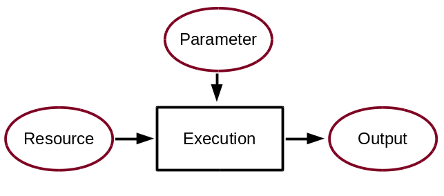

# Instructions

> **Code of Conduct:** Before we start please be aware that contributors to this project are expected to act respectfully toward others in accordance with the [OSGeo Code of Conduct](https://www.osgeo.org/code_of_conduct/)


## Set up a birdhouse application based on PyGeoAPI 

> To be developed

## Set up a birdhouse application package based on WPS 

The following sections are describing how to transfer scientific methods into technical services which are deployable in CRIS.

## Get started with the environment

The climate application packages (=birds) are designed to run in their own environment. This is avoiding dependency conflicts, when multiple birds are installed in a Climate Resilience Information System. The environments are organized with [conda](https://docs.conda.io/en/latest/) repective [mamba](https://github.com/conda-forge/miniforge#mambaforge).

## Set up the skeleton of your new climate application package
The following sections are describing how to transfer scientific methods into technical services which are deployable in climate resilience information systems. This is necessary when appropriate scientific methods are not already available and accessible as technical services. [Birdhouse](http://bird-house.github.io/) organisation lowers the barriers to set up new climate application package by providing tools enable you to build your own customised [OGC API Processes](https://ogcapi.ogc.org/processes/) application in support of web-based geospatial (climate) data analysis.

Within the Birdhouse organisation you can find an appropriate utility to set up a skeleton for a new climate application package:

* A [Cookiecutter template](https://github.com/bird-house/cookiecutter-birdhouse) to create your own [PyWPS](http://pywps.org/) compute service.

The cookiecutter can be installed with:

```
conda install -c conda-forge cookiecutter cruft
```

## Example: build the Building Block 'duck'

We show here an example how to build your processing service application, *duck*, using the cookiecutter template. Run the cookiecutter with the birdhouse template:

```
cruft create https://github.com/bird-house/cookiecutter-birdhouse.git
```

Once cookiecutter clones the template, you will be asked a series of questions related to your project:
```console
full_name [Full Name]: Alice Kingsleigh
email [your@email]: alice@wonderland.org
github_username [bird-house]: clint
project_name [Babybird]: duck
project_slug [duck]:
project_repo_name [duck]:
project_readthedocs_name [duck]:
project_short_description [A Web Processing Service for Climate Data Analysis.]: A Demo Web Service for Clint.
version [0.1.0]:
Select open_source_license:
1 - Apache Software License 2.0
2 - MIT license
3 - BSD license
4 - ISC license
5 - GNU General Public License v3
6 - Not open source
Choose from 1, 2, 3, 4, 5, 6 [1]: 1
http_port [5000]:
use_pytest [y]: y
create_author_file [y]: y
```
We have created a *duck* app for the *CLINT* project using this template.

## create the birds environment.
The new bird is coming with as a fully operational service. The appropriate environment is defined in the ./{birdname}/environment.yml file and can be installed with

```
mamba env create
```
or
```
conda env create
```

to switch into the environment:
```
conda activate duck
```

## Installing and running the bird
Since the climate build blocks are web services, they need to be started to make the service available. They can be installed with running in the root folder and activated environment of the bird:
```
pip install -e .
```
Which is installing the service.
With `duck start`, the service is up and running.

testable in a webbrowser:

http://localhost:5000/wps?version=1.0.0&request=GetCapabilities&&service=WPS
or
http://localhost:5000/wps?version=1.0.0&request=DescribeProcess&&service=WPS&identifier=hello


## Fill your new climate application package with scientific algorithms

Once your new climate application package is created, it needs to be filled with scientific algorithms.
In contrast to a script that you are running locally in an individual way a service needs to be standardised.
The following figure is illustrating the principles design of a technical service. Input data needs to be provided by a given address to the appropriate resouces and parameters to modify the execution needs to be provided as well.
On the other side, the number of output files are defined as well. Here number and format will be fixed.

```{figure} /media/guide_processscheema.png
```

Basically your existing code can be integrated by simply taking care of some rules:

*    no hard coding of path to local data sources, since the building block should run on all kinds of different servers
*    encapsulating the processing steps in `try` and `exception` brackets with senseful log messages


<!-- [Another point to think about when designing a process is the possibility of chaining processes together. The result of a process can be a final result or be used as an input for another process. Chaining processes is a common practice but depends on the user you are designing the service for. Technically, for the development of Services process chaining, here are a few summary points:

*    the functional code should be modular and provide an interface/method for each single task
*    provide a wps process for each task
*    wps processes can be chained, manually or within the code, to run a complete workflow
*    wps chaining can be done manually, with workflow tools, direct wps chaining or with code scripts
*    a complete workflow chain could also be started by a wps process.

```{figure} /media/guide_serviceschain.png
```   -->
### Writing functions

A Process is calling several functions during the performance. Since WPS is a autonom running process several eventualities needs to be taken into account. If irregularities are occurring, it is a question of the process design if the performance should stop and return an error or continue with maybe a modified result.

In practice, the functions should be encapsulated in **try** and **except** calls and appropriate information given to the logfile or shown as a status message. The logger has several options to to influence the running code and the information writing to the logfile:

![image] /images/guide_fuctionschain.png


```python
   # the following two line needs to be in the beginning of the *.py file.
   # The ._handler will find the appropriate logfile and include timestemps
   # and module information into the log.

   import logging
   LOGGER = logging.getLogger("PYWPS")

   # set a status message
   per = 5  # 5 will be 5% in the status line
   response.update_status('execution started at : {}'.fromat(dt.now()), per)

   try:
       response.update_status('the process is doing something: {}'.fromat(dt.now()),10)
       result = 42
       LOGGER.info('found the answer of life')
   except Exception as ex:
       msg = 'This failed but is obligatory for the output. The process stops now, because: {} '.format(ex)
       LOGGER.error(msg)

  try:
      response.update_status('the process is doing something else : {}'.fromat(dt.now()), 20)
      interesting = True
      LOGGER.info(' Thanks for reading the guidelines ')
      LOGGER.debug(' I need to know some details of the process: {} '.format(ex))
  except Exception as ex:
      msg = 'This failed but is not obligatory for the output. The process will continue. Reason for the failure: {} '.format(ex)
     LOGGER.exception(msg)
```

<!-- In the following sections we are using the [Duck](https://github.com/climateintelligence/duck) software as example to guide you through the different stepps necessay to set up an application package to be deployed in an CRIS and used for **Climate Services**.

Here we understand **Application Packages for CRIS** as standalone software in line to the [OGC API standards](https://developer.ogc.org). Several of this climate application packages can be found in the [Birdhouse](http://bird-house.github.io/) organisation which is a collection on OGC Standards based software. These software blocks can be used to build customised Climate Resilience Information System. The building blocks for climate services can be named with birdnames.

The demo web-application has been created by Carsten Ehbrecht and Étienne Plésiat in the framework of the work package 8 of the [CLINT](https://climateintelligence.eu/) H2020 project. Duck provides an AI-enhanced service to infill missing values in climate datasets. 


If you are familiar with all the upper chapters you are ready to create your own WPS. The WPS in birdhouse are named after birds, so this section is giving you a guidline of how to make your own bird. Birds are sorted thematically, so before setting up a new one, make sure it is not already covered and just missing some processes and be clear in the new thematic you would like to provide.

There is a [Cookiecutter](https://github.com/bird-house/cookiecutter-birdhouse.git) template to create a new bird (PyWPS based application). It is the recommended and fastest way to create your own
bird.


### Writing a WPS process
In birdhouse, we are using the [PyWPS]() implementation of a
`Web Processing Service`{.interpreted-text role="term"}. Please read the
[PyWPS
documentation](https://pywps.readthedocs.io/en/master/process.html) on
how to implement a WPS process.

:::: note
::: title
Note
:::

To get started quickly, you can try the [Emu]() WPS with some example
processes for PyWPS.
::::



Another point to think about when designing a process is the possibility
of chaining processes together. The result of a process can be a final
result or be used as an input for another process. Chaining processes is
a common practice but depends on the user you are designing the service
for. Technically, for the development of WPS process chaining, here are
a few summary points:

-   the functional code should be modular and provide an
    interface/method for each single task
-   provide a wps process for each task
-   wps processes can be chained, manually or within the code, to run a
    complete workflow
-   wps chaining can be done manually, with workflow tools, direct wps
    chaining or with code scripts
-   a complete workflow chain could also be started by a wps process.


### Writing functions

A Process is calling several functions during the performance. Since WPS
is a autonom running process several eventualities needs to be taken
into account. If irregularities are occurring, it is a question of the
process design if the performance should stop and return an error or
continue with may be an modified result.

In practice, the functions should be encapsulated in **try** and
**except** calls and appropriate information given to the logfile or
shown as a status message. The logger has several options to to
influence the running code and the information writing to the logfile:


``` {.python linenos=""}
# the following two line needs to be in the beginning of the *.py file.
# The ._handler will find the appropriate logfile and include timestemps
# and module information into the log.

import logging
LOGGER = logging.getLogger("PYWPS")

# set a status message
per = 5  # 5 will be 5% in the status line
response.update_status('execution started at : {}'.fromat(dt.now()), per)

try:
    response.update_status('the process is doing something: {}'.fromat(dt.now()),10)
    result = 42
    LOGGER.info('found the answer of life')
except Exception as ex:
    msg = 'This failed but is obligatory for the output. The process stops now, because: {} '.format(ex)
    LOGGER.error(msg)

try:
    response.update_status('the process is doing something else : {}'.fromat(dt.now()), 20)
    interesting = True
    LOGGER.info(' Thanks for reading the guidelines ')
    LOGGER.debug(' I need to know some details of the process: {} '.format(interesting)
except Exception as ex:
    msg = 'This failed but is not obligatory for the output. The process will continue. Reason for the failure: {} '.format(ex)
    LOGGER.exception(msg)
```

### Writing tests

Writing tests is an essential part of software development. The WPS templates produced by Cookiecutter_ include the initial folders needed for units tests and basic dependencies in the environment.
There are two parts of tests:

* Unit tests:
python pytest to check the functionality of functions and processes. They are stored in the folder `{bird WPS}/tests` and appropriate test data  `{bird WPS}/tests/testdata`.

* notebook tests:
Code examples of the documentation to demonstrate the usage of WPS services. The examples are written in jupyter notebooks and stored in the documentation folder `{bird WPS}/docs/source/notebooks/`
```
--> 