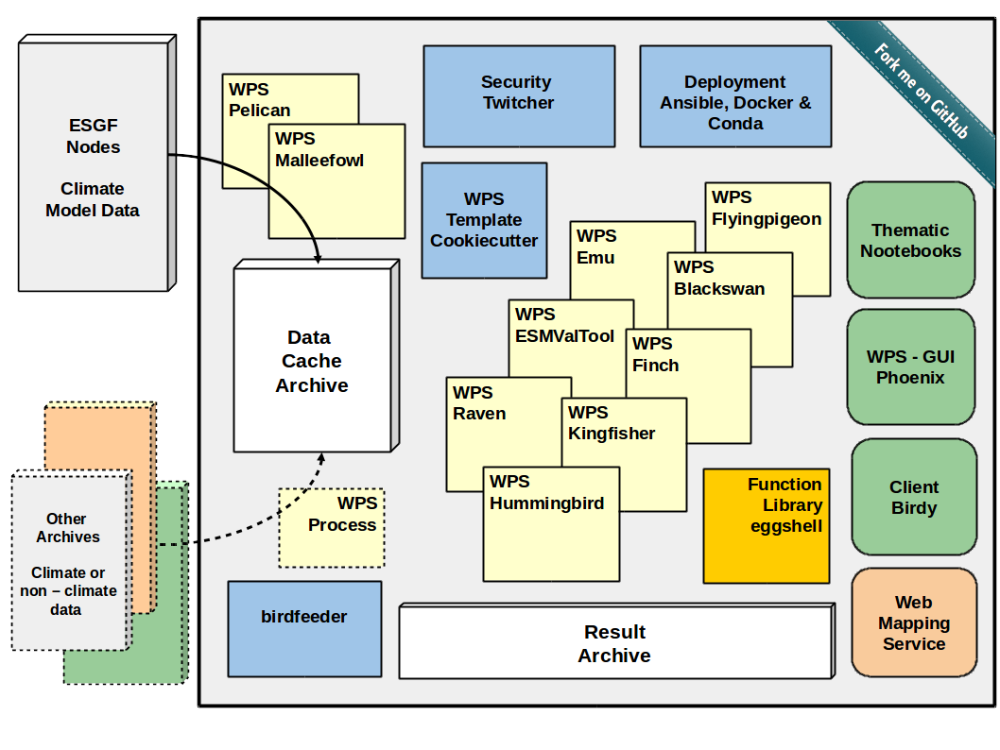

# **Deploy an ecosystem of Climate Services Infromation System**

The **birdhouse framework** is modular organized to enable a flexible architecture design depending on the projects needs. To enable FAIR Climate Services the applications are cpmoient to international approved standards, mainly following OGC Standards. Therefore software components developed outside of the birdhouse framework can be combined in the architectures enshuring interoperability.



## Delopy a single service: Inpaint missing values 

The following is a demo web-application developed within the the Climate Intellignce [CLINT project](https://climateintelligence.eu) providing a process to inpaint missing values in datasets with AI-enhanced Climate Science. It is based on the [Phoenix](https://pyramid-phoenix.readthedocs.io/en/latest/) web-application from the [Birdhouse](http://bird-house.github.io/) collection and makes use of the [PyWPS](https://pywps.org/) Python package, which is an implementation of the [Web Processing Service](https://www.ogc.org/standards/wps) standard from the [Open Geospatial Consortium](https://www.ogc.org/). The implemented scientific methode is available as application **Climate Reconstraction AI** [CRAI](https://github.com/FREVA-CLINT/climatereconstructionAI/tree/clint), a state-of-the-art deep learning based inpainting technology to infill missing values in climate datasets[^1].

The current demo gives the possibility to infill near-surface air temperature anomalies in the [HadCRUT4](https://www.metoffice.gov.uk/hadobs/hadcrut4/) and [HadCRUT5](https://www.metoffice.gov.uk/hadobs/hadcrut5/) datasets. The input and output netCDF files are handled through an intuitive user interface.

[^1]: [Kadow, C. *et al.*, *Nature Geoscience* 13, 408–413 (2020)](http://dx.doi.org/10.1038/s41561-020-0582-5)

## Install duck with conda

We need `mamba` to install the requirements. Use your existing `mamba` or install it from here: https://github.com/conda-forge/miniforge

Get the source:
```
git clone https://github.com/climateintelligence/duck.git
cd duck
```

Create the conda environment for duck:
```
mamba env create
```

Activate the duck environment:
```
conda activate duck
```

Install duck in this environment:
```
pip install -e .
```

Start your duck as a web service:
```
duck start -d
```

See it is responding by sending a WPS `GetCapabilities` request:
```
http://localhost:5000?service=WPS&request=GetCapabilities
```

You can stop the service with:
```
duck stop
```

## Deploy an entire Climate Services Information System

If you are already familiar with installing single standalone service, then you are ready to set up an entire ecosystem of services and adding an online graphical user interphases to offer a portal for the user.

> Extended explanation of deployment options including entire scripts are available in the [birdhouse-deploy repository](https://birdhouse-deploy.readthedocs.io/en/latest/) 

### Prepare Installation

It is recommended to collect the repositories in a separate folder (e.g. birdhouse, but can have a name of your choice):

    $ mkdir birdhouse
    $ cd birdhouse

### Get the source code from GitHub

``` ini
$ git clone https://github.com/bird-house/pyramid-phoenix.git
$ git clone https://github.com/bird-house/finch.git
$ git clone https://github.com/bird-house/malleefowl.git
```

### Run Installation

As described above for the inpainting missing value, you can run the installation with default settings. It will create a conda environment and deploy all required software dependencies there. Read the *changing the default configuration* if you want to customize the configuration. In **all** of the tree folders (finch, duck and pyramid-phoenix) run:

    $ make install

This installation will take some minutes to fetch all dependencies and
install them into separate conda environments.

### Start the Services

in **all** of the birds run:

    $ make start

### Launching the Phoenix Web App

If the services are running, you can launch the GUI in a common web browser. By default, phoenix is set to port 8081:

    open http://localhost:8081

or:

    open https://localhost:8443/

Now you can log in (upper right corner) with your Phoenix password created previously. Phoenix is just a graphical interface with no more function than looking nice ;-).

### Register a service in Phoenix Web GUI

> Please read the [Phoenix documentation](https://pyramid-phoenix.readthedocs.io/en/latest/user_guide.html#)

Your first administration step is to register *finch* as a service. For that, log in with your phoenix password. In the upper right corner is a tool symbol to open the *settings*. Click on *Services* and the *Register a Service*.

Finch is per default on port 5000.

The appropriate url is:

    http://localhost:5000/wps

Provide service title and name as you like: **Service Title: Finch** Service Name: finch. 
Check *Service Type*: **Web Processing Service** (default) and register. Optionally, you can check **Public access?**, to allow unregistered users to launch jobs. (**NOT recommended**)

### Launching a Job
Now your birdhouse ecosysem is set up. The also installed malleefowl is
already running in the background and will do a lot of work silently.
There is **no need to register malleefowl** manually!

Launching a job can be performed as a process (Process menu) or with the wizard. To get familliar with the processes provided by each of the birds, read the approriate documentation for each of the services listed in the **Application List**

### Changing the default configuration

You can customize the configuration of the service. Please read the
documentation, for example:

-   [Phoenix configuration](https://pyramid-phoenix.readthedocs.io/en/latest/configuration.html)
-   [Finch configuration](https://pavics-sdi.readthedocs.io/projects/finch/en/latest/configuration.html)

Furthermore, you might change the hostname (to make your service accessible from outside), ESGF-node connection, the port or the log-level for more/less information in the administrator logfiles. Here is an example *pyramid-phoenix/custom.cfg*:

``` ini
[settings]
hostname = localhost
http-port = 8081
https-port = 8443
log-level = DEBUG
# run 'make passwd' and to generate password hash
phoenix-password = sha256:513....
# generate secret
# python -c "import os; print(''.join('%02x' % ord(x) for x in os.urandom(16)))"
phoenix-secret = d5e8417....30
esgf-search-url = https://esgf-data.dkrz.de/esg-search
wps-url = http://localhost:8091/wps
```

### Update Phoenix Password

To be able to log into the Phoenix GUI once the services are running, it is necessary to generate a password: go into the pyramid-phoenix folder and run:

    $ make passwd

This will automatically write a password hash into *pyramid-phoenix/custom.cfg*

## Backups

See the [mongodb documentation](https://docs.mongodb.com/manual/core/backups/) on how to backup the database. With the following command you can make a dump of the `users` collection of the Phoenix database:

    $ mongodump --port 27027 --db phoenix_db --collection users


<!-- This section is outdated \...
:::

### General Remarks

| Check the `requirements`{.interpreted-text role="ref"} of your system!
| The installation is done as **normal user**, root rights are causing
  conflicts.


Birdhouse consists of several components like [Malleefowl]() and
[Emu](). Each of them can be installed individually. The installation is
done using the Python-based build system `Buildout`{.interpreted-text
role="term"}. Most of the dependencies are maintained in the
`Anaconda Python distribution`{.interpreted-text role="term"}. For
convenience, each birdhouse component has a
`Makefile <bootstrap:makefile>`{.interpreted-text role="ref"} to ease
the installation so you don\'t need to know how to call the Buildout
build tool.

## Requirements

Birdhouse uses `Anaconda Python distribution`{.interpreted-text
role="term"} for most of the dependencies. If Anaconda is not already
installed, it will be installed during the installation process.
Anaconda has packages for Linux, MacOSX and Windows. But not all
packages used by birdhouse are already available in the default package
channel of Anaconda. The missing packages are supplied by birdhouse on
`Binstar`{.interpreted-text role="term"}. But we currently maintain only
packages for Linux 64-bit and partly for MacOSX.

So the short answer to the requirements is: **you need a Linux 64-bit
installation**.

Birdhouse is currently used on Ubuntu 14.04 and CentOS 6.x. It should
also work on Debian, LinuxMint and Fedora.

Birdhouse also installs a few system packages using
[apt-get]{.title-ref} on Debian based distributions and
[yum]{.title-ref} on RedHat/CentOS based distributions. For this you
need a user account with [sudo]{.title-ref} permissions. Installing
system packages can be done in a separate step. So your installation
user does not need any special permissions. All installed files will go
into a birdhouse Anaconda environment in the home folder of the
installation user.

## Installing from source

The installation of birdhouse components from source is done with some
few commands. Here is an example for the Emu WPS service:

``` sh
$ git clone https://github.com/bird-house/emu.git
$ cd emu
$ make clean install
$ make start
$ firefox http://localhost:8094/wps
```

All the birdhouse components follow the same installation pattern. If
you want to see all the options of the [Makefile]{.title-ref} then type:

``` sh
$ make help
```

You will find more information about these options in the
`Makefile documentation <bootstrap:makefile>`{.interpreted-text
role="ref"}.

Read the documention of each birdhouse component for the details of the
installation and how to configure the components. The
`birdhouse bootstrap documentation <bootstrap:introduction>`{.interpreted-text
role="ref"} gives some `examples <bootstrap:examples>`{.interpreted-text
role="ref"} of the different ways of making the installation.

On the WPS client side we have:

-   [Phoenix](): a Pyramid web application.
-   [Birdy](): a simple WPS command line tool.

On the WPS server side we have:

-   [Malleefowl](): provides base WPS services to access data.
-   [Flyingpigeon](): provides WPS services for the climate impact
    community.
-   [Hummingbird](): provides WPS services for CDO and climate metadata
    checks.
-   [Emu](): just some WPS processes for testing.

## Nginx, gunicorn and supervisor

Birdhouse sets up a `PyWPS`{.interpreted-text role="term"} server (and
also the Phoenix web application) using `Buildout`{.interpreted-text
role="term"}. We use the `Gunicorn`{.interpreted-text role="term"} HTTP
application server (similar to Tomcat for Java servlet applications ) to
run these web applications with the `WSGI`{.interpreted-text
role="term"} interface. In front of the Gunicorn application server, we
use the `Nginx`{.interpreted-text role="term"} HTTP server (similar to
the Apache web server). All these web services are started/stopped and
monitored by a `Supervisor`{.interpreted-text role="term"} service.

See the following image for how this looks like:


When installing a birdhouse WPS service, you don\'t need to care about
this setup. This is all done by Buildout and using some extensions
provided by birdhouse.

The Makefile of a birdhouse application has convenience targets to
start/stop a WPS service controlled by the Supervisor and to check the
status:

``` sh
$ make start    # start wps service
$ make stop     # stop wps service
$ make status   # show status of wps service
Supervisor status ...
/home/pingu/.conda/envs/birdhouse/bin/supervisorctl status
emu                              RUNNING   pid 25698, uptime 0:00:02
malleefowl                       RUNNING   pid 25702, uptime 0:00:02
mongodb                          RUNNING   pid 25691, uptime 0:00:02
nginx                            RUNNING   pid 25699, uptime 0:00:02
phoenix                          RUNNING   pid 25694, uptime 0:00:02
pycsw                            RUNNING   pid 25700, uptime 0:00:02
tomcat                           RUNNING   pid 25693, uptime 0:00:02
```

You can also use the Supervisor monitor web service which by default is
available on port <http://localhost:9001/>. The Supervisor monitor app
looks like in the following screenshot.


## Using birdhouse with Docker {#docker}

An alternative way to install and deploy birdhouse Web Processing
Services is by using `Docker`{.interpreted-text role="term"}. The
birdhouse WPS servers are available as a Docker image on [Docker
Hub](https://hub.docker.com/r/birdhouse/). See an example on how to use
them with the `Emu WPS Docker image <emu:tutorial>`{.interpreted-text
role="ref"}.
 -->