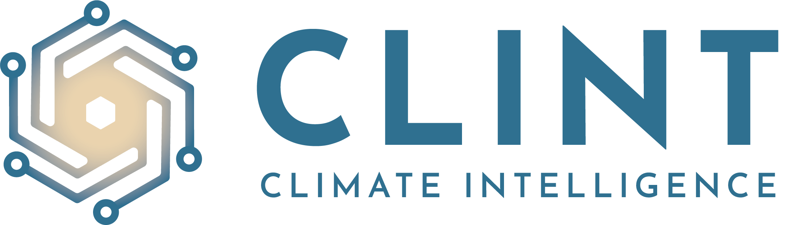
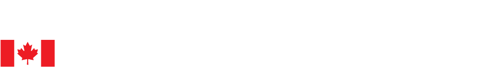

# **Contribution**

> **Code of Conduct:** Before we start please be aware that contributors to this project are expected to act respectfully toward others in accordance with the [OSGeo Code of Conduct](https://www.osgeo.org/code_of_conduct/)

Birdhouse is a comunity driven international initiative with many contributors from all over the world. Here is an unfinished list of projects which had actively contributed to the development. The birdhouse **framework is modular organized** to enable a flexible architecture design depending on the projects needs. Due to the OCG Standard complience, software components can be combined for interoperability. Here are some examples of ongoing or finished projects to show the flexibility and potential of the birdhouse framework.

In case of questions or trouble shooting, feel welcome to join the [birdhouse chat](https://gitter.im/bird-house/birdhouse) and get into contact with the developers directly. If you recognise a project not listed here, which should be recognised here, get in contact.

## Project examples

| Logo | Project focus and contribution |
| -------- | ------- |
|  | The main objective of **CLINT** is the development of an Artificial Intelligence framework composed of Machine Learning techniques and algorithms to process big climate datasets for improving Climate Science in the detection, causation, and attribution of Extreme Events (EEs), namely tropical cyclones, heatwaves and warm nights, droughts, and floods. The CLINT AI framework will also cover the quantification of the EE impacts on a variety of socio-economic sectors under historical, forecasted, and projected climate conditions, and across different spatial scales (from European to local), ultimately developing innovative and sectorial AI-enhanced Climate Services. Finally, these services will be operationalized into Web Processing Services, according to the most advanced open data and software standards by Climate Services Information Systems, and into a Demonstrator to facilitate the uptake of project results by public and private entities for research and Climate Services development.   Further information: [further reading: CLINT Homepage](https://climateintelligence.eu) |
| DACCS Project| The aim of the DACCS project is to drastically simplify the time-consuming tasks required to extract relevant climate information from large data sets, allowing researchers to focus on solving scientific problems rather than on data management. | 
|  | [PAVICS](https://ouranosinc.github.io/pavics-sdi/): Platform for climate analysis and visualization [PAVICS-Hydro](https://medium.com/birdhouse-newsletter/web-processing-services-for-hydrological-modeling-7b5eb5c426ed) This work funded by CANARIE is based on the birdhouse architecture and the Raven hydrological framework |
| EUCLEIA | The synergy present in the EUropean CLimate and weather Events: Interpretation and Attribution (**EUCLEIA**) facilitated new scientific developments that provides the foundation of an operational attribution service. The consortium drew on the specialist expertise of the project partners who contributed building blocks that could be integrated into a reliable, well-tested, fit-for-purpose attribution service.   [further reading: EUCLEIA Homepage](https://eucleia.eu) |
| C3Grid | The Collaborative Climate Community Data and Processing Grid (C3Grid). Early beginning of interoperable Climate Services infrastructures |
| -------- | ------- |

### OGC-Testbeds and Pilots

-   OGC Climate and Disaster Resilience Pilot 24
-   OGC Climate Resilience Pilot 22
-   OGC Disaster Pilot 22
-   OGC Testbed 14: Enhancement of security
-   OGC Testbed 13: Enhancement of scheduling services

# Funding and in-kind contribution

|  |
| :--: |
| 
             
 |  
| :--: |

<!-- 

## COPERNICUS

-   CP4CDS: Climate Projects for the [Climate Data
    Store](https://cds.climate.copernicus.eu/) (part of the European
    Union\'s [Copernicus Climate Change
    Service](https://climate.copernicus.eu/)).

## PAVICS

-   [PAVICS](https://ouranosinc.github.io/pavics-sdi/): Platform for
    climate analysis and visualization by
    [Ouranos](https://www.ouranos.ca/) and
    [CRIM](https://www.crim.ca/en), Canada.
-   [PAVICS-Hydro](https://medium.com/birdhouse-newsletter/web-processing-services-for-hydrological-modeling-7b5eb5c426ed)
    : Additional services for
    [PAVICS](https://ouranosinc.github.io/pavics-sdi/) allowing users to
    perform hydrological modeling and analysis.

[Pavics](https://pavics-sdi.readthedocs.io/en/latest/index.html)

## DACCS
-   [DACCS](https://daccs.ca/): *Data Analytics for Canadian Climate
    Services* is a collaboration between the [University of
    Toronto](https://www.utoronto.ca/), the Pacific Climate Impacts
    Consortium ([PCIC](https://www.pacificclimate.org/)), the Computer
    Research Institute of Montréal ([CRIM](https://www.crim.ca/en)), and
    [Ouranos](https://www.ouranos.ca/).

    This project evolved from
    [PAVICS](https://ouranosinc.github.io/pavics-sdi/) developments, by
    extending [Birdhouse]() services with multiple new capabilities, and
    providing an *Infrastructure as Code* (IaC) [birdhouse-deploy]()
    definition allowing the customizable selection of server
    [components](https://birdhouse-deploy.readthedocs.io/en/latest/#birdhouse).

## Demonstrators and projects

[CLINT](https://clint.dkrz.de/) 

[Climatedata](https://climatedata.ca/)

## OGC-Testbeds

::: todo
Add references to OGC testbed.
:::
-   OGC Testbed 13: Enhancement of scheduling services
-   OGC Testbed 14: Enhancement of security
| [OGC EO-Pilot](http://docs.opengeospatial.org/per/20-045.html%23_open_source_software_4&amp;sa=D&amp;source=editors&amp;ust=1660816924243900&amp;usg=AOvVaw22QBuuFacKi801Tvd-c-LC)  | | | 

 -->

