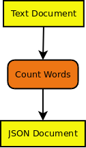
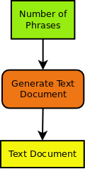
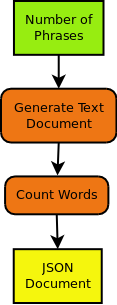
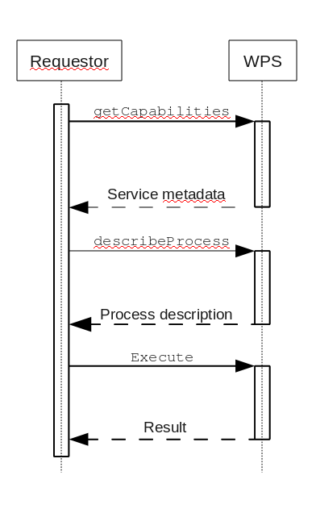

# WPS general usage

In the following we show an example with a [Word Counter]{.title-ref}
function which is enabled as a web-service using WPS.

> Find a detailed description of WPS usage at the [Birdhouse Workshop](https://birdhouse.readthedocs.io/projects/workshop/en/latest/pywps.html)

## Defining a *\`Word Counter\`* function

In the following example we will use the [Word Counter]{.title-ref}
function:

    def count_words(file):
        """Calculates number of words in text document.
        Returns JSON document with occurrences of each word.
        """
        return json_doc

This Python function has the following parts:

-   a \`name or\` \`identifier\`: count_words
-   a \`description\`: Calculates number of words \...
-   \`input parameters\`: file (mime type [text/plain]{.title-ref})
-   \`output parameters\`: json_doc (mime type [application/json]{.title-ref})

Now, we would like to run this function remotely using a simple
web-service. To get this web-service we can use WPS. The function parts
(name, parameters) are all we need to know to define a WPS process.

## WPS definition of *\`Word Counter\`*

To add a new proccess you need to define the input and output
parameters. For the [Word Counter]{.title-ref} process this looks like
the following.



Here is another example for a [Text Generator]{.title-ref} process. We
will use it later for chaining processes.



There are two types of input/output parameters:

-   Literal Parameters (green): these are simple data types like
    integer, boolean, string, \...
-   Complex Parameters (yellow): these are documents with a mime-type
    (xml, cvs, jpg, netcdf, \...) provided as URL or directly.

An input/output parameter has:

-   a name or [identifier]{.title-ref}
-   a descriptive [title]{.title-ref}
-   an [abstract]{.title-ref} giving a description of the parameter
-   [multiplicity]{.title-ref} \... how often can this parameter occur:
    optional, once, many \...
-   in case of literal parameters a list of [allowed
    values]{.title-ref}.


## Chaining WPS processes {#chaining_WPS}

If you know the input/output parameters of processes you can chain processes. For example we will chain a [Text Generator]{.title-ref} process to our [Word Counter]{.title-ref} process.



The [Text document]{.title-ref} output of the [Text Generator]{.title-ref} process becomes the input of [Word Counter]{.title-ref} process.

You can chain process manually by calling them one after the other. The WPS specification allows you to also chain process with a single WPS request. To get even more flexibility (using if-clauses, loops, monitoring \...) you can also use a `workflow engine <workflow>`{.interpreted-text role="term"} (`Taverna`{.interpreted-text role="term"}, `VisTrails`{.interpreted-text role="term"}, `Dispel4py`{.interpreted-text role="term"}, \...).

You will find more details about chaining in the [GeoProcessing document](http://geoprocessing.info/wpsdoc/Concepts#chaining) and the [GeoServer Tutorial](http://geoserver.geo-solutions.it/edu/en/wps/chaining_processes.html).

## WPS process implementation with PyWPS

There are several WPS implementations available (`GeoServer`{.interpreted-text role="term"}, `COWS`{.interpreted-text role="term"}, \...). In birdhouse, we use the Python implementation `PyWPS`{.interpreted-text role="term"}. In [PyWPS]{.title-ref} the [Word Counter]{.title-ref} process could look like the following:

::: {.literalinclude language="python" emphasize-lines="8,16,24,32" linenos=""}
\_tutorial/wps_word_counter.py
:::

You can see the definition of the input and output parameters and the `execute()` method where the real `count_words()` function is called. You will find more details about implementing a WPS process in the [PyWPS Tutorial](http://pywps.org/docs/).

## Using WPS

A WPS service has three operations:

-   \`GetCapabilities\`: which processes are available
-   \`DescribeProcess\`: what are the input and output parameters of a specific process
-   \`Execute\`: run a process with parameters.

The following diagram shows these operations:



To call these process one can use simple HTTP request with key/value
pairs:

-   [GetCapabilites]{.title-ref} request:

        http://localhost:8094/wps?&request=GetCapabilities&service=WPS&version=1.0.0

-   [DescribeProcess]{.title-ref} request for [wordcount]{.title-ref} process:

        http://localhost:8094/wps?&request=DescribeProcess&service=WPS&version=1.0.0&identifier=wordcount

-   [Exceute]{.title-ref} request:

        http://localhost:8094/wps?request=Execute&service=WPS&version=1.0.0&identifier=wordcount
                                &DataInputs=text=http://birdhouse.readthedocs.org/en/latest/index.html

A process can be run [synchronously]{.title-ref} or \`asynchronously\`:

-   sync: You make a HTTP request and you need to wait until the request
    returns with a response (or timeout). This is only useful for
    short-running processes.
-   async: You make a HTTP request and you get immediately a response
    document. This document gives you a link to a status document which
    you need to poll until the process has finished.

Processes can be run with simple HTTP get-requests (as shown above) and
also with HTTP post-requests. In the later case XML documents are
exchanged with the communication details (process, parameters, \...).

There are also some [IPython notebooks](http://nbviewer.jupyter.org/github/bird-house birdhouse-docs/tree/master/notebooks/tutorial/) which show the usage of WPS.

## Calling [Word Counter]{.title-ref} with Birdy

Now, we are using [Birdy]() wps command line client to access the [wordcount]{.title-ref} process.

Which proccess are available ([GetCapabilities]{.title-ref}):

    $ birdy -h
    usage: birdy [-h] <command> [<args>]

    optional arguments:
      -h, --help            show this help message and exit

    command:
      List of available commands (wps processes)

      {chomsky,helloworld,inout,ultimatequestionprocess,wordcount}
                          Run "birdy <command> -h" to get additional help.

What input and output parameters does [wordcount]{.title-ref} have ([DescribeProcess]{.title-ref}):

    $ birdy wordcount -h
    usage: birdy wordcount [-h] --text [TEXT] [--output [{output} [{output} ...]]]

    optional arguments:
      -h, --help            show this help message and exit
      --text [TEXT]         Text document: URL of text document, mime
                          types=text/plain
      --output [{output} [{output} ...]]
                          Output: output=Word count result, mime
                          types=text/plain (default: all outputs)

Run [wordcount]{.title-ref} with a text document
([Execute]{.title-ref}):

    $ birdy wordcount --text http://birdhouse.readthedocs.org/en/latest/index.html
    Execution status: ProcessAccepted
    Execution status: ProcessSucceeded
    Output:
    output=http://localhost:8090/wpsoutputs/emu/output-37445d08-cf0f-11e4-ab7e-68f72837e1b4.txt


## WPS Documentation {#appendix_wps_docs}

-   [What is WPS?](http://geoprocessing.info/wpsdoc/Concepts#what)
-   [WPS on OSGeo
    Live](http://download.osgeo.org/livedvd/doc-dev/standards/wps_overview.html)
-   [WPS
    tutorial](http://wiki.ieee-earth.org/Documents/GEOSS_Tutorials/GEOSS_Provider_Tutorials/Web_Processing_Service_Tutorial_for_GEOSS_Providers/Section_2:_Introduction_to_WPS)
-   [OGC Web Processing Service
    Standard](http://www.opengeospatial.org/standards/wps)
-   [PyWPS Wiki](http://wiki.rsg.pml.ac.uk/pywps/Main_Page)
-   [GeoServer
    tutorial](http://geoserver.geo-solutions.it/edu/en/wps/index.html)

Talks:

-   [The WPS 2.0 standard (preliminary
    information)](http://www.slideshare.net/Bender82/2014-0715the-wps-20-standardpreliminary?related=2)
-   [WPS Application
    Patterns](http://www.slideshare.net/nuest/wps-application-patterns?related=1)
-   [Using WPS (PyWPS) with Taverna
    Orchestration](http://www.slideshare.net/JorgeMendesdeJesus/taverna?related=2)
-   [Pywps a tutorial for beginners and
    developers](http://www.slideshare.net/JorgeMendesdeJesus/pywps-a-tutorial-for-beginners-and-developers?related=3)
-   [Zoo presentation
    foss4g.jp-2011](http://www.slideshare.net/masarunarazaki/zoo-presentation-foss4gjp2011?related=4)

## WPS Software

WPS Server Software:

-   `PyWPS`{.interpreted-text role="term"}
-   GeoServer -
    <http://docs.geoserver.org/stable/en/user/services/wps/index.html>
-   Zoo - `http://www.zoo-project.org/`
-   `COWS`{.interpreted-text role="term"}
-   Deegree - <http://www.deegree.org/>
-   52 North - <http://52north.org/communities/geoprocessing/wps/>

WPS Client Software:

-   `OWSLib Python Client <OWSLib>`{.interpreted-text role="term"}
-   OpenLayers WPS Plugin -
    <http://dev.openlayers.org/docs/files/OpenLayers/WPSClient-js.html>
-   GeoTools WPS Module -
    <http://docs.geotools.org/latest/userguide/unsupported/wps.html>
-   52 North Java Client -
    <http://52north.org/communities/geoprocessing/wps/index.html>
-   52 North Javascript Client -
    <http://geoprocessing.demo.52north.org:8080>
-   WPS Javascript Client by Boundless -
    <https://github.com/boundlessgeo/wps-gui>

QGIS Desktop GIS with wps plugins:

-   <http://www.qgis.org/en/site/>
-   <http://plugins.qgis.org/plugins/wps/>
-   <http://geolabs.fr/plugins.xml>

uDig Desktop GIS with wps plugins:

-   <http://udig.refractions.net/>
-   <https://udig.github.io/docs/user/reference/Using%20the%20WPS%20plugin.html>
-   <https://github.com/52North/uDig-WPS-plugin> (outdated)


<!-- 
### Hello World WPS (emu):

-   `Emu Example with Docker <emu:tutorial>`{.interpreted-text role="ref"}

### Create a conda package

::: todo
How to create a conda package
:::
### Python syntax: {#python_guide}

``` ipython3
"""Python WPS execute"""

from owslib.wps import WebProcessingService, monitorExecution
from os import system
```

**Footnotes**

 -->